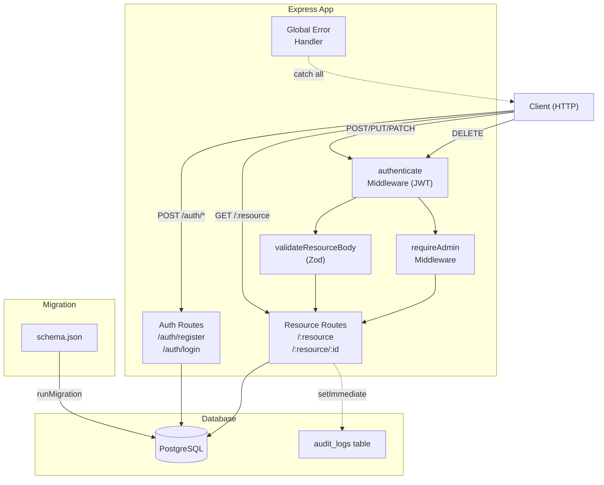

**Nguyễn Trong Đức**
**DucNT190**
**HN26_FR_ReactJS_01**


# Smart API Hub

REST API Platform tự động sinh API từ file `schema.json`.  
Hỗ trợ Dynamic CRUD, Advanced Query, Relationships, Auth & Authorization.

---

## Tech Stack

| Layer | Công nghệ |
|---|---|
| Runtime | Node.js ≥ 20, TypeScript (Strict) |
| Framework | Express.js v5 |
| Database | PostgreSQL ≥ 15 + Knex.js |
| Validation | Zod |
| Auth | JWT + Bcrypt |
| Testing | Vitest + Supertest |
| Infra | Docker + Docker Compose |

---

## API Docs (Swagger UI)

**Live (Render):** https://smart-api-hub-1jw1.onrender.com/api-docs/

---

## Architecture



---

## Chạy bằng Docker (khuyến nghị)

> Yêu cầu: Docker Desktop đang chạy

```bash
# 1. Clone repo
git clone https://github.com/<your-username>/smart-api-hub.git
cd smart-api-hub

# 2. Chạy toàn bộ stack (app + PostgreSQL)
docker-compose up --build

# Server sẽ tự động:
#   - Khởi động PostgreSQL
#   - Chạy migration từ schema.json
#   - Lắng nghe tại http://localhost:3000
```

Dừng:
```bash
docker-compose down          # giữ data
docker-compose down -v       # xoá luôn volume
```

---

## Chạy thủ công (local dev)

### 1. Yêu cầu

- Node.js ≥ 20
- PostgreSQL ≥ 15 đang chạy

### 2. Cài đặt

```bash
npm install
```

### 3. Cấu hình môi trường

```bash
cp .env.example .env
# Chỉnh sửa .env cho phù hợp với local PostgreSQL
```

### 4. Chạy dev

```bash
npm run dev
```

### 5. Build & chạy production

```bash
npm run build
npm start
```

---

## Chạy Tests

> Yêu cầu: PostgreSQL đang chạy và `.env` đã cấu hình đúng

```bash
npm test
```

Tests bao gồm 14 test cases:
- Health check
- Auth happy path (register, login)
- Auth error cases (invalid email, duplicate, wrong password)
- Resource happy path (GET list, pagination, POST, PATCH, DELETE)
- Resource error cases (401, 403, 404, invalid ID)

---

## API Docs (Swagger UI)

Sau khi server chạy, truy cập:

```
http://localhost:3000/api-docs
```

---

## Các Endpoint Chính

### System
| Method | Path | Mô tả |
|---|---|---|
| GET | `/health` | Kiểm tra trạng thái server + DB |

### Auth
| Method | Path | Mô tả |
|---|---|---|
| POST | `/auth/register` | Đăng ký tài khoản |
| POST | `/auth/login` | Đăng nhập, nhận JWT token |

### Dynamic CRUD
| Method | Path | Auth | Mô tả |
|---|---|---|---|
| GET | `/:resource` | Không | Lấy danh sách |
| GET | `/:resource/:id` | Không | Lấy theo ID |
| POST | `/:resource` | User | Tạo mới |
| PUT | `/:resource/:id` | User | Thay thế toàn bộ |
| PATCH | `/:resource/:id` | User | Cập nhật một phần |
| DELETE | `/:resource/:id` | Admin | Xoá |

### Query Parameters

| Param | Ví dụ | Mô tả |
|---|---|---|
| `_fields` | `?_fields=id,title` | Chọn cột trả về |
| `_page` + `_limit` | `?_page=2&_limit=5` | Phân trang |
| `_sort` + `_order` | `?_sort=title&_order=desc` | Sắp xếp |
| `_expand` | `?_expand=users` | Lấy dữ liệu bảng cha (JOIN) |
| `_embed` | `?_embed=comments` | Lấy dữ liệu bảng con |
| `q` | `?q=hello` | Tìm kiếm toàn văn (text columns) |
| `<col>_gte/lte/ne/like` | `?id_gte=5` | Filtering nâng cao |


---

## Code Structure

```
smart-api-hub/
├── src/
│   ├── index.ts                        # Entry point, khởi động server
│   ├── app.ts                          # Khởi tạo Express app, register routes & middleware
│   ├── config/
│   │   ├── jwt.ts                      # JWT secret & sign/verify helpers
│   │   └── swagger.ts                  # Swagger/OpenAPI spec config
│   ├── controllers/
│   │   ├── auth.controller.ts          # register, login handlers
│   │   └── resource.controller.ts      # Dynamic CRUD (list, getById, create, update, delete)
│   ├── db/
│   │   ├── knex.ts                     # Knex instance (PostgreSQL connection)
│   │   └── migrate.ts                  # Auto-migration từ schema.json
│   ├── middlewares/
│   │   ├── auth.middleware.ts          # authenticate (JWT) + requireAdmin
│   │   ├── error.middleware.ts         # Global error handler
│   │   └── validate.middleware.ts      # Zod body validation middleware
│   ├── routes/
│   │   ├── auth.routes.ts              # POST /auth/register, /auth/login
│   │   └── resource.routes.ts          # Dynamic /:resource routes
│   └── utils/
│       ├── auditLog.ts                 # Ghi audit log vào DB (async, non-blocking)
│       ├── resourceBodySchema.ts       # Sinh Zod schema từ schema.json tại runtime
│       ├── tableValidator.ts           # Kiểm tra resource name hợp lệ
│       └── validate.ts                 # Zod helper utilities
├── tests/
│   └── app.test.ts                     # Integration tests (Vitest + Supertest)
├── schema.json                         # Định nghĩa bảng & seed data
├── docker-compose.yaml
├── Dockerfile
├── tsconfig.json
└── vitest.config.ts
```

---

## Schema mẫu (`schema.json`)

```json
{
  "users":    [{ "email": "...", "password": "...", "role": "admin" }],
  "posts":    [{ "title": "...", "content": "...", "user_id": 1 }],
  "comments": [{ "body": "...", "post_id": 1, "user_id": 1 }]
}
```

Thêm bảng mới = thêm key mới vào `schema.json`, restart là xong.
